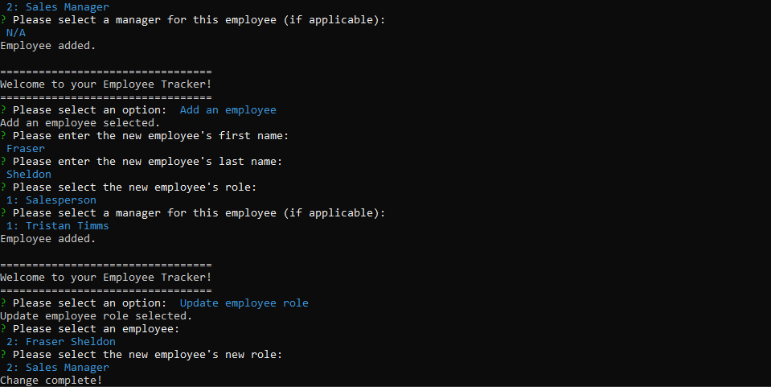

# Employee Tracker

## About the Project

Welcome to my Employee Tracker! Using this application, you can easily organize your company's information. Invoked from the command line, a series of prompts will be displayed that will organize your departments, roles, and employees into a database.

## Table of Contents

- [Installation Instructions](#installation-instructions)
- [Examples of Use](#examples-of-use)
- [Contributions](#contributions)
- [License Information](#license-information)
- [Contact Me](#contact-me)

## Installation Instructions

1. Install [Node.js](https://coding-boot-camp.github.io/full-stack/nodejs/how-to-install-nodejs) and [MySQL](https://coding-boot-camp.github.io/full-stack/mysql/mysql-installation-guide)
2. Clone the repository and navigate to it via the command line.
3. Install required dependencies with the command `npm install inquirer mysql2`
4. Open the MySQL Shell with `mysql -u <your-mysql-username> -p`
5. To get the database up and running, type in the shell `source db/db.sql; source db/schema.sql;`
6. Finally, enter the command `node index` and have fun!

- [Instructional Video]()

## Examples of Use

You can use this application to easily organize and track your employees!

## Contributions

- Completed with direction from the Vanderbilt Full-Stack Coding Bootcamp

## License Information

Copyright (c) by William Ingram, 2022

Licensed under the [MIT](https://opensource.org/licenses/MIT) license.

## Contact Me

- GitHub: wingram1
- Email: waingram96@gmail.com
